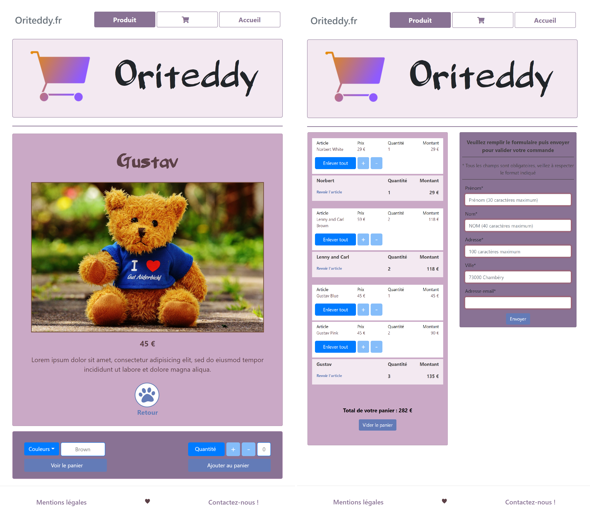

# About :
* [The front-end (this repository)](#the-front-end)
* [The back-end](#the-back-end)
* [The project](#the-project)

## The front-end

To get it working on your computer, follow these steps :

1. Clone this repo :  
`git clone https://github.com/ChristopheBouriel/Oriteddy.git`

2. Enter inside the root folder of the project :  
`cd Oriteddy`

3. Type the command bellow :  
`npm install`

4. Wait for everything to be installed, then type :  
`npm run-script start`

Since I used Yeoman and its workflow which comes with gulp as a task runner, among other things we have a local web server with a fast live reload, and the command above call "gulp serve" to launch this one.  
A new tab will automatically open in your browser, or you can find it at localhost:9000

## The back-end

The back-end has been provided by Openclassrooms as part of a project for the Junior Web Develepper training.  
You can find the Github repository by following this link :  
https://github.com/OpenClassrooms-Student-Center/JWDP5

However, I already deployed it on Heroku so that you can directly use the app.
You just need to change `http://localhost:3000` for `https://orinoco-back-end.herokuapp.com` in the
following files : main.js, product.js and basket.js  
You'll find them in the "scripts" folder inside the "app" folder

## The project

You can get more details about this project in my portfolio :  
https://portfolio-christophe-bouriel.netlify.app  
By the way, the whole site has also been deployed and you can find it on Internet :  
https://oriteddy.netlify.app